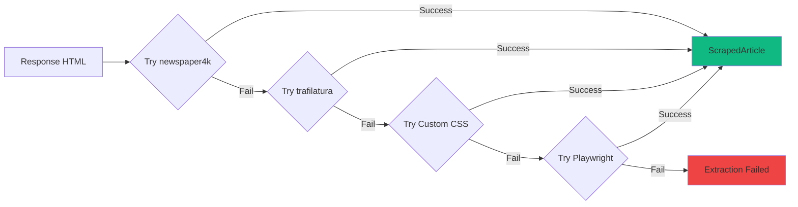

ScrapAI is an orchestration layer on top of Scrapy. Instead of writing Python spider files, an AI agent generates JSON configs stored in a database. A single generic spider loads any config at runtime.

## High-Level Architecture

```mermaid
graph TB
    subgraph "User Interface"
        CLI["CLI (Click)"]
    end
    
    subgraph "Storage Layer"
        DB[("Database<br/>(SQLite/PostgreSQL)")]
    end
    
    subgraph "Core Components"
        Spider["DatabaseSpider<br/>(Generic)"
        Extractors["Extractors<br/>(newspaper/trafilatura/custom)"]
        Handlers["CloudflareHandler<br/>(nodriver)"]
        Middleware["SmartProxyMiddleware"]
    end
    
    subgraph "Scrapy Framework"
        Engine["Scrapy Engine"]
        Scheduler["Scheduler"]
        Downloader["Downloader"]
        Pipeline["Item Pipeline"]
    end
    
    subgraph "Output"
        JSONL["JSONL Files"]
        DBItems[("ScrapedItems Table")]
    end
    
    CLI --> DB
    CLI --> Engine
    DB --> Spider
    Spider --> Extractors
    Spider --> Engine
    Engine --> Scheduler
    Scheduler --> Downloader
    Downloader --> Handlers
    Downloader --> Middleware
    Engine --> Spider
    Spider --> Pipeline
    Pipeline --> JSONL
    Pipeline --> DBItems
    
    style CLI fill:#6366f1
    style DB fill:#8b5cf6
    style Spider fill:#10b981
    style Engine fill:#f59e0b
```

## Component Breakdown

### Entry Point: `scrapai` Script

```bash scrapai Script
#!/usr/bin/env bash
# Auto-activates virtualenv, delegates to CLI
./scrapai crawl bbc_co_uk --project news
```

The `scrapai` entry point:
- Auto-activates the virtual environment (no manual `source venv/bin/activate`)
- Delegates commands to the Click-based CLI
- Handles environment setup and validation

### CLI Layer (`cli/`)

Built with [Click](https://click.palletsprojects.com/), the CLI provides commands for:

<CardGroup cols={2}>
  <Card title="Spider Management" icon="spider">
    `spiders list`, `spiders import`, `spiders delete`
  </Card>
  
  <Card title="Crawling" icon="arrows-spin">
    `crawl <spider>` with test mode (`--limit`) and production mode
  </Card>
  
  <Card title="Data Access" icon="table">
    `show <spider>`, `export <spider>` (CSV/JSON/JSONL/Parquet)
  </Card>
  
  <Card title="Queue Management" icon="list-check">
    `queue add`, `queue bulk`, `queue list`, `queue next`
  </Card>
</CardGroup>

```python CLI Structure
cli/
├── __init__.py        # Main CLI entry point
├── spiders.py         # Spider CRUD commands
├── crawl.py           # Crawl execution
├── data.py            # Show and export commands
├── queue.py           # Batch processing queue
└── inspect.py         # URL inspection tool
```

### Database Layer (`core/models.py`, `core/db.py`)

ScrapAI uses SQLAlchemy with support for both SQLite (default) and PostgreSQL (production).

#### Core Models

<Tabs>
  <Tab title="Spider">
    ```python Spider Model
    class Spider(Base):
        __tablename__ = "spiders"
        
        id = Column(Integer, primary_key=True)
        name = Column(String, unique=True, index=True)
        allowed_domains = Column(JSON)  # ["example.com"]
        start_urls = Column(JSON)       # ["https://example.com"]
        source_url = Column(String)     # Original URL provided by user
        active = Column(Boolean)        # Enable/disable without deletion
        project = Column(String)        # Project grouping
        callbacks_config = Column(JSON) # Custom callback definitions
        created_at = Column(DateTime)
        updated_at = Column(DateTime)
        
        # Relationships
        rules = relationship("SpiderRule")
        settings = relationship("SpiderSetting")
        items = relationship("ScrapedItem")
    ```
    
    **Key Point**: Spiders are rows, not files. Adding a website means inserting a row.
  </Tab>
  
  <Tab title="SpiderRule">
    ```python SpiderRule Model
    class SpiderRule(Base):
        __tablename__ = "spider_rules"
        
        id = Column(Integer, primary_key=True)
        spider_id = Column(Integer, ForeignKey("spiders.id"))
        
        allow_patterns = Column(JSON)    # ["/news/articles/.*"]
        deny_patterns = Column(JSON)     # ["/news/.*#comments"]
        restrict_xpaths = Column(JSON)   # Limit link extraction scope
        restrict_css = Column(JSON)      # CSS-based link restriction
        
        callback = Column(String)        # "parse_article" or None
        follow = Column(Boolean)         # Follow links from this rule?
        priority = Column(Integer)       # Rule execution order
    ```
    
    **Scrapy Mapping**: These map directly to Scrapy's `Rule` and `LinkExtractor`.
  </Tab>
  
  <Tab title="SpiderSetting">
    ```python SpiderSetting Model
    class SpiderSetting(Base):
        __tablename__ = "spider_settings"
        
        id = Column(Integer, primary_key=True)
        spider_id = Column(Integer, ForeignKey("spiders.id"))
        
        key = Column(String)    # "DOWNLOAD_DELAY"
        value = Column(String)  # "2" (stored as string)
        type = Column(String)   # "int", "float", "bool", "string"
    ```
    
    **Examples**: `EXTRACTOR_ORDER`, `CLOUDFLARE_ENABLED`, `CONCURRENT_REQUESTS`
  </Tab>
  
  <Tab title="ScrapedItem">
    ```python ScrapedItem Model
    class ScrapedItem(Base):
        __tablename__ = "scraped_items"
        
        id = Column(Integer, primary_key=True)
        spider_id = Column(Integer, ForeignKey("spiders.id"))
        
        url = Column(String, unique=True, index=True)
        title = Column(String)
        content = Column(Text)
        published_date = Column(DateTime)
        author = Column(String)
        scraped_at = Column(DateTime)
        metadata_json = Column(JSON)  # Custom fields go here
    ```
    
    **Storage Modes**:
    - Test mode (`--limit N`): Saves to database for inspection
    - Production mode: Exports to JSONL files, optionally saves to DB
  </Tab>
</Tabs>

#### Database Configuration

```python core/db.py
from sqlalchemy import create_engine
from sqlalchemy.orm import sessionmaker

# SQLite (default) or PostgreSQL from .env
DATABASE_URL = os.getenv("DATABASE_URL", "sqlite:///scrapai.db")

engine = create_engine(DATABASE_URL)

# SQLite optimizations
@event.listens_for(engine, "connect")
def set_sqlite_pragma(dbapi_conn, connection_record):
    if "sqlite" in DATABASE_URL:
        cursor = dbapi_conn.cursor()
        cursor.execute("PRAGMA journal_mode=WAL")  # Write-Ahead Logging
        cursor.execute("PRAGMA synchronous=NORMAL")
        cursor.execute("PRAGMA cache_size=-64000")  # 64MB cache
        cursor.close()
```

<Info>
  **SQLite vs PostgreSQL**: SQLite is perfect for development and small-scale production. Switch to PostgreSQL for multi-user access or high concurrency.
</Info>

### Spider Layer (`spiders/database_spider.py`)

The magic happens here: **one spider class for all websites**.

```python DatabaseSpider Core
class DatabaseSpider(BaseDBSpiderMixin, CrawlSpider):
    name = "database_spider"
    
    def __init__(self, spider_name=None, *args, **kwargs):
        self.spider_name = spider_name
        self._load_config()  # Load from database
        super().__init__(*args, **kwargs)
    
    def _load_config(self):
        """Load spider configuration from database"""
        db = next(get_db())
        spider = db.query(Spider).filter(Spider.name == self.spider_name).first()
        
        if not spider:
            raise ValueError(f"Spider '{self.spider_name}' not found")
        
        # Apply config to spider instance
        self.allowed_domains = spider.allowed_domains
        self.start_urls = spider.start_urls
        
        # Compile rules from database
        self.rules = []
        for r in spider.rules:
            le_kwargs = {}
            if r.allow_patterns:
                le_kwargs["allow"] = r.allow_patterns
            if r.deny_patterns:
                le_kwargs["deny"] = r.deny_patterns
            
            self.rules.append(
                Rule(LinkExtractor(**le_kwargs), 
                     callback=r.callback, 
                     follow=r.follow)
            )
```

**Execution Flow**:

1. CLI runs: `./scrapai crawl bbc_co_uk --project news`
2. `DatabaseSpider` instantiated with `spider_name="bbc_co_uk"`
3. `_load_config()` queries the database for `bbc_co_uk` spider
4. Config applied: domains, URLs, rules, settings
5. Scrapy engine starts crawling with the loaded config

### Extraction Layer (`core/extractors.py`)

ScrapAI uses a **fallback chain** of extractors:



<Tabs>
  <Tab title="newspaper4k">
    ```python NewspaperExtractor
    class NewspaperExtractor(BaseExtractor):
        def extract(self, url, html, title_hint=None):
            article = newspaper.Article(url)
            article.download(input_html=html)
            article.parse()
            
            return ScrapedArticle(
                url=url,
                title=article.title or title_hint,
                content=article.text,
                author=", ".join(article.authors),
                published_date=article.publish_date,
                source="newspaper4k",
                metadata={
                    "top_image": article.top_image,
                    "keywords": article.keywords
                }
            )
    ```
    
    **Best for**: News articles, blogs, standard article layouts
  </Tab>
  
  <Tab title="trafilatura">
    ```python TrafilaturaExtractor
    class TrafilaturaExtractor(BaseExtractor):
        def extract(self, url, html, title_hint=None):
            data = trafilatura.bare_extraction(html, url=url)
            
            return ScrapedArticle(
                url=url,
                title=data.get("title") or title_hint,
                content=data.get("text"),
                author=data.get("author"),
                published_date=data.get("date"),
                source="trafilatura",
                metadata={
                    "description": data.get("description"),
                    "categories": data.get("categories")
                }
            )
    ```
    
    **Best for**: Articles, documentation, text-heavy content
  </Tab>
  
  <Tab title="Custom CSS">
    ```python CustomExtractor
    class CustomExtractor(BaseExtractor):
        def __init__(self, selectors):
            # selectors = {"title": "h1.title", "content": "div.article"}
            self.selectors = selectors
        
        def extract(self, url, html, title_hint=None):
            soup = BeautifulSoup(html, "lxml")
            
            title = self._extract_text(soup, self.selectors.get("title"))
            content = self._extract_text(soup, self.selectors.get("content"))
            author = self._extract_text(soup, self.selectors.get("author"))
            
            return ScrapedArticle(
                url=url,
                title=title or title_hint,
                content=content,
                author=author,
                source="custom"
            )
    ```
    
    **Best for**: Non-standard layouts, structured data extraction
  </Tab>
  
  <Tab title="Playwright">
    ```python Playwright Rendering
    async def _extract_with_playwright_async(self, url, ...):
        from utils.browser import BrowserClient
        
        async with BrowserClient() as browser:
            await browser.goto(url)
            html = await browser.get_html()
            
            # Try trafilatura on rendered HTML
            return TrafilaturaExtractor().extract(url, html)
    ```
    
    **Best for**: JavaScript-rendered content, dynamic pages
  </Tab>
</Tabs>

**Extractor Configuration**:

```json Spider Settings
{
  "settings": {
    "EXTRACTOR_ORDER": ["newspaper", "trafilatura"],
    "CUSTOM_SELECTORS": {
      "title": "h1.article-title",
      "content": "div.article-body"
    }
  }
}
```

### Handlers and Middleware

<AccordionGroup>
  <Accordion title="CloudflareHandler (handlers/cloudflare_handler.py)">
    Bypasses Cloudflare protection using [nodriver](https://github.com/ultrafunkamsterdam/nodriver) for browser automation.
    
    **How it works**:
    1. Browser solves the Cloudflare challenge once
    2. Extract session cookies (`cf_clearance`)
    3. Switch to fast HTTP requests with cached cookies
    4. Refresh cookies every 10 minutes
    
    **Performance**: ~5-10s for initial challenge, then ~200-500ms per request.
    
    ```json Enable Cloudflare Bypass
    {
      "settings": {
        "CLOUDFLARE_ENABLED": true
      }
    }
    ```
  </Accordion>
  
  <Accordion title="SmartProxyMiddleware (middlewares.py)">
    Automatically escalates to proxies on blocks (403/429 errors).
    
    **Escalation Flow**:
    1. Start with direct connections
    2. On 403/429, retry with datacenter proxy
    3. Remember domain for future requests
    4. Residential proxies require explicit opt-in
    
    **Configuration**:
    ```bash .env
    DATACENTER_PROXY_USERNAME=your_username
    DATACENTER_PROXY_PASSWORD=your_password
    DATACENTER_PROXY_HOST=proxy.example.com
    DATACENTER_PROXY_PORT=10000
    ```
  </Accordion>
</AccordionGroup>

### Pipeline Layer (`pipelines.py`)

The item pipeline handles storage:

```python DatabasePipeline
class DatabasePipeline:
    def __init__(self):
        self.items_buffer = []
        self.buffer_size = 50  # Batch writes
    
    def process_item(self, item, spider):
        self.items_buffer.append(item)
        
        if len(self.items_buffer) >= self.buffer_size:
            self._flush_to_db()
        
        return item
    
    def _flush_to_db(self):
        with get_db() as db:
            for item_data in self.items_buffer:
                item = ScrapedItem(
                    spider_id=item_data["spider_id"],
                    url=item_data["url"],
                    title=item_data.get("title"),
                    content=item_data.get("content"),
                    # ... other fields
                )
                db.add(item)
            db.commit()
        self.items_buffer.clear()
```

**Storage Modes**:

<Tabs>
  <Tab title="Test Mode">
    ```bash Test Mode
    ./scrapai crawl bbc_co_uk --project news --limit 10
    ```
    
    - Saves to database (`scraped_items` table)
    - Inspect with: `./scrapai show bbc_co_uk --project news`
    - Export with: `./scrapai export bbc_co_uk --project news --format csv`
  </Tab>
  
  <Tab title="Production Mode">
    ```bash Production Mode
    ./scrapai crawl bbc_co_uk --project news
    ```
    
    - Exports to timestamped JSONL: `data/news/bbc_co_uk/crawl_20260228_143022.jsonl`
    - Enables checkpoint pause/resume (Ctrl+C to pause)
    - Optional database storage via settings
  </Tab>
</Tabs>

## Data Flow: End-to-End

<Steps>
  <Step title="User Runs Crawl Command">
    ```bash
    ./scrapai crawl bbc_co_uk --project news --limit 5
    ```
  </Step>
  
  <Step title="CLI Invokes Scrapy">
    `cli/crawl.py` constructs Scrapy command:
    ```python
    process = CrawlerProcess(settings)
    process.crawl(DatabaseSpider, spider_name="bbc_co_uk")
    process.start()
    ```
  </Step>
  
  <Step title="DatabaseSpider Loads Config">
    Queries database for `bbc_co_uk` spider, applies domains/URLs/rules/settings.
  </Step>
  
  <Step title="Scrapy Engine Starts">
    Scheduler queues start URLs, Downloader fetches pages, Spider processes responses.
  </Step>
  
  <Step title="Extraction">
    For each response:
    - Try newspaper4k → trafilatura → custom CSS → Playwright
    - Return `ScrapedArticle` or None
  </Step>
  
  <Step title="Pipeline Storage">
    Items buffered and batch-written to database or JSONL files.
  </Step>
  
  <Step title="Output Available">
    ```bash
    ./scrapai show bbc_co_uk --project news
    ./scrapai export bbc_co_uk --project news --format csv
    ```
  </Step>
</Steps>

## Key Design Decisions

<CardGroup cols={2}>
  <Card title="Generic Spider" icon="spider">
    One spider class loads any config at runtime. No code generation, no Python files per site.
  </Card>
  
  <Card title="Database as Config Store" icon="database">
    Spiders are rows, not files. Change settings across 100 spiders with one SQL query.
  </Card>
  
  <Card title="Fallback Extraction" icon="layer-group">
    Multiple extractors in a chain. If newspaper fails, try trafilatura. If that fails, try custom CSS.
  </Card>
  
  <Card title="Validation Before Execution" icon="shield-check">
    All configs validated through Pydantic schemas. Malformed configs fail before execution.
  </Card>
</CardGroup>

## Next Steps

<CardGroup cols={2}>
  <Card title="Database-First Philosophy" icon="database" href="/concepts/database-first">
    Learn why spiders live in the database
  </Card>
  
  <Card title="Extractors Deep Dive" icon="magnifying-glass" href="/core/extractors">
    Understand the extraction chain in detail
  </Card>
</CardGroup>