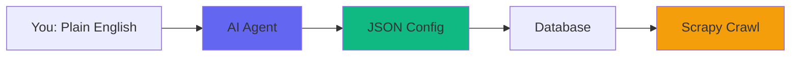

ScrapAI uses AI at build time to generate scraper configurations, then runs them deterministically with Scrapy. You pay the inference cost once per website, not per page.

## The Core Principle

When building scrapers at scale, you have three options:

<CardGroup cols={3}>
  <Card title="Web Scraping Services" icon="credit-card">
    Pay per page, per request, or per API call. Fine for small volumes, expensive at scale.
  </Card>
  <Card title="AI-Powered Runtime" icon="brain">
    Call an LLM on every page to extract data. Smart but costly—10,000 pages = 10,000 inference calls.
  </Card>
  <Card title="AI Once, Deterministic Forever" icon="check" color="#10b981">
    Use AI at build time to analyze the site and write extraction rules. Then run with Scrapy—no AI in the loop.
  </Card>
</CardGroup>

ScrapAI implements **option 3**. The cost is per website, not per page. After the initial analysis, you own the scraper and can run it indefinitely without additional AI costs.

## The Flow



<Steps>
  <Step title="Describe in Plain English">
    You tell the agent what you want: `"Add https://bbc.co.uk to my news project"`
  </Step>
  
  <Step title="AI Agent Analyzes">
    The agent fetches sample pages, identifies URL patterns, determines the site structure, and chooses an extraction strategy.
  </Step>
  
  <Step title="Generate JSON Config">
    The agent produces a validated JSON configuration with URL rules, extraction settings, and spider metadata.
  </Step>
  
  <Step title="Store in Database">
    The config is saved as a database row. No Python files, no code generation—just structured data.
  </Step>
  
  <Step title="Run with Scrapy">
    A generic spider (`DatabaseSpider`) loads the config at runtime and executes the crawl. Same spider for every website.
  </Step>
</Steps>

## AI Once, Run Forever

The key insight: **the agent writes config, not code**.

<CodeGroup>
```bash AI Phase (Once)
# Agent analyzes the site and generates config
./scrapai spiders import bbc_spider.json --project news
```

```bash Execution Phase (Forever)
# Run the spider as many times as you want - no AI costs
./scrapai crawl bbc_co_uk --project news
./scrapai crawl bbc_co_uk --project news
./scrapai crawl bbc_co_uk --project news
# ... months later ...
./scrapai crawl bbc_co_uk --project news
```
</CodeGroup>

Every execution after the first is pure Scrapy: fast, deterministic, and free.

## Why JSON Configs Instead of AI-Generated Python?

<Warning>
  An agent that writes and executes Python has the same power as an unsupervised developer. If it hallucinates, gets prompt-injected by a malicious page, or loses context, it can do real damage.
</Warning>

By constraining the agent to write JSON configs:

<AccordionGroup>
  <Accordion title="Security: Validation Before Execution">
    All configs go through strict Pydantic validation before they touch the database or crawler:
    
    - Spider names restricted to `^[a-zA-Z0-9_-]+$`
    - URLs validated: HTTP/HTTPS only, no private IPs (127.0.0.1, 10.x, 192.168.x)
    - Callback names validated with reserved names blocked
    - Settings whitelisted: bounded concurrency (1-32), bounded delays (0-60s)
    - SQL via SQLAlchemy ORM with parameterized bindings
    
    Malformed configs fail validation before execution.
  </Accordion>
  
  <Accordion title="Safety: No Code Execution">
    The agent produces data, not code. The worst case is a bad config that extracts wrong fields—caught in the test crawl and trivially fixable.
    
    At runtime, Scrapy executes deterministically with no AI in the loop.
  </Accordion>
  
  <Accordion title="Portability: Export and Share">
    JSON configs are portable data structures. Export a spider config, import it into another project, share it with your team, or version control it like any other data file.
  </Accordion>
  
  <Accordion title="Maintainability: No Code Drift">
    When 5 developers write 100 spiders, you get 5 different styles. ScrapAI produces uniform configs with the same schema, validation, and structure.
  </Accordion>
</AccordionGroup>

## Example: A Real Spider Config

Here's what an AI-generated spider config looks like for BBC News:

```json BBC News Spider Config
{
  "name": "bbc_co_uk",
  "source_url": "https://bbc.co.uk/",
  "allowed_domains": ["bbc.co.uk", "www.bbc.co.uk"],
  "start_urls": ["https://www.bbc.co.uk/"],
  "rules": [
    {
      "allow": ["/news/articles/.*"],
      "deny": ["/news/articles/.*#comments"],
      "callback": "parse_article"
    },
    {
      "allow": ["/sport/.*/articles/.*"],
      "callback": "parse_article"
    }
  ],
  "settings": {
    "EXTRACTOR_ORDER": ["newspaper", "trafilatura"],
    "DOWNLOAD_DELAY": 1,
    "CONCURRENT_REQUESTS": 16,
    "ROBOTSTXT_OBEY": true
  }
}
```

<Info>
  This config defines URL patterns to match, extraction strategies to use, and Scrapy settings. The `DatabaseSpider` loads it at runtime and executes the crawl.
</Info>

### What the Agent Figured Out

From a single instruction (`"Add https://bbc.co.uk to my news project"`), the agent:

1. **Discovered URL patterns**: `/news/articles/.*` for news, `/sport/.*/articles/.*` for sports
2. **Chose extractors**: newspaper4k and trafilatura work well for BBC's article structure
3. **Set rate limits**: 1-second delay between requests to be respectful
4. **Filtered noise**: Deny comments sections with `#comments`

No CSS selectors to write, no HTML inspection, no trial and error.

## The Cost Equation

<Card title="Traditional AI Scraping" icon="calculator">
  **Per-page inference**: 10,000 pages × $0.001 per call = **$10 per crawl**
  
  Run weekly for a year: **$520 per site**
</Card>

<Card title="ScrapAI" icon="piggy-bank" color="#10b981">
  **One-time inference**: ~20 pages analyzed = **$0.02 once**
  
  Run forever: **$0.02 total**
</Card>

For 100 websites scraped weekly:
- Traditional AI: **$52,000/year**
- ScrapAI: **$2 once**

## When the Site Changes

Websites redesign. Layouts change. Scrapers break.

With ScrapAI:

```bash Fixing a Broken Spider
# Detect the breakage (via test crawl)
./scrapai crawl bbc_co_uk --project news --limit 5
# Output shows missing fields

# Point the agent at the broken spider
"Fix the bbc_co_uk spider - the site redesigned"

# Agent re-analyzes, updates the config, verifies the fix
# New config imported to database, spider ready to run
```

The re-analysis is another AI call (a few cents), then you're back to deterministic execution.

## Key Takeaways

<CardGroup cols={2}>
  <Card title="One-Time Cost" icon="chart-line">
    AI inference happens once during spider creation. Every subsequent crawl is pure Scrapy—fast and free.
  </Card>
  
  <Card title="No Code Generation" icon="shield-check">
    The agent writes validated JSON configs, not executable Python. Safer, more portable, easier to maintain.
  </Card>
  
  <Card title="Database-First" icon="database">
    Spiders are database rows, not files. Change settings across 100 spiders with one SQL query.
  </Card>
  
  <Card title="Production Ready" icon="rocket">
    Every generated spider comes with a test config (5 sample URLs). Run test crawls to verify before production.
  </Card>
</CardGroup>

## Next Steps

<CardGroup cols={2}>
  <Card title="Architecture" icon="sitemap" href="/concepts/architecture">
    Understand the system components and data flow
  </Card>
  
  <Card title="Database-First Philosophy" icon="database" href="/concepts/database-first">
    Learn why spiders live in the database, not in files
  </Card>
</CardGroup>